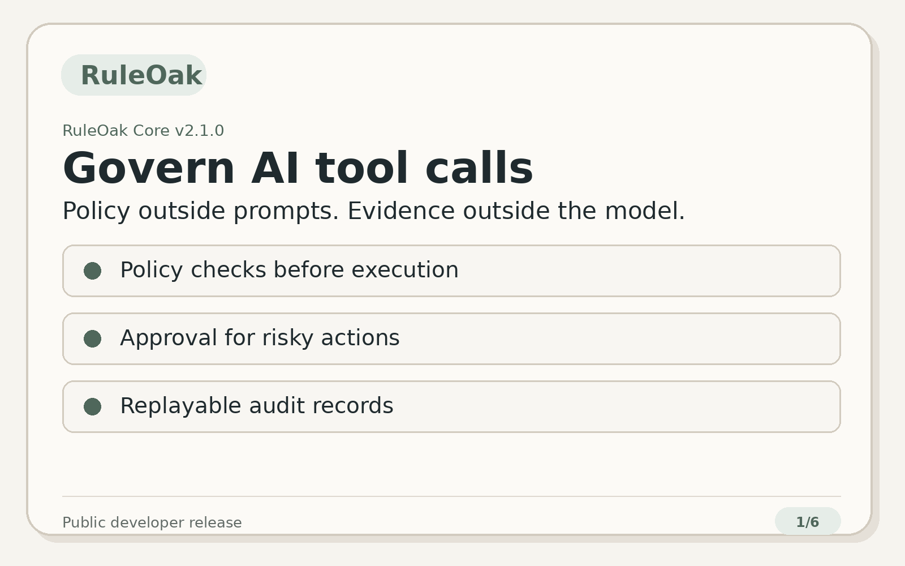

<p align="center">
  
</p>

# RuleOak Core v2.1.0

> **Governance for AI tool calls.**
>
> Block dangerous actions, require approval for risky ones, keep policy outside prompts, and generate replayable audit records.

```text
tool call → policy decision → evidence → approval if needed → audit trail → report
```

RuleOak Core is an AGPL local-first governance layer for developers building AI agents, MCP-style tools, LangGraph/CrewAI workflows, local LLM workflows, and vertical AI apps where unchecked tool execution is not acceptable.

- Latest public release: **v2.1.0**
- Previous public release: **v2.0.3**
- Earlier public baseline: **v1.0.1**
- Stable governance protocol: **ruleoak.governance.v1**

[Website](https://ruleoak.com) · [Start in 10 minutes](docs/adoption/10-minute-quickstart.md) · [Governance Protocol v1](docs/protocol/governance-records-v1.md) · [Conformance Kit](docs/protocol/conformance-kit.md) · [Security model](docs/trust/security-model.md) · [License FAQ](docs/license-faq.md)

---

## 60-second demo



```text
AI proposes actions
→ safe read is allowed
→ risky external send requires approval
→ destructive file deletion is blocked
→ evidence-backed audit report is generated
```

---

## Start in 10 minutes

```bash
npm install
npm run quickstart:all
npm run adoption:real-frameworks
npm run audit:viewer:v2:check
npm run product:surface:check
```

Expected decisions:

| Proposed tool call | Decision | Why |
|---|---|---|
| `search_docs` | allowed | read-only local evidence action |
| `send_external_message` | approval required | external communication needs review |
| `delete_workspace_file` | denied | destructive action is blocked before execution |

Open generated reports under:

```text
reports/html/
```

For a guided local first run:

```bash
npm run launch
```

---

## Why developers use RuleOak

| Developer need | RuleOak provides |
|---|---|
| Add governance without redesigning the app | tool-call wrappers, MCP path, adapter helpers |
| Get audit records automatically | run, evidence, approval, policy, audit, and report records |
| Separate policy from prompts | policy packs and explicit policy-decision records |
| Prevent dangerous tool calls by default | allow / approval-required / deny before execution |
| Generate evidence-backed reports | JSON/HTML reports, evidence bundles, audit viewer |
| Support local-first workflows | local policy, local approvals, local reports, offline verification |
| Keep a path toward serious use cases | stable protocol, conformance kit, signed integrity, security-boundary tests |

RuleOak is not an agent orchestrator. It sits at the action boundary and governs what the agent wants to do.

---

## What is included in v2.1.0

| Area | Included |
|---|---|
| Governance runtime | runs, evidence, approvals, audit events, policy decisions, reports |
| Tool Guard | evaluate proposed tool calls before execution |
| MCP path | MCP-style guard and local MCP proxy pattern |
| Governance Protocol v1 | schemas, golden records, replay checks, standalone conformance kit |
| Python path | Python SDK compatibility guidance and conformance fixtures |
| Adapters | LangGraph, CrewAI, and MCP adapter patterns |
| Policy packs | versioned, scenario-tested, explainable, diffable, signed packs |
| Approval UX | local approval inbox with reviewer notes, evidence requests, approval packets |
| Audit Viewer v2 | local static viewer, verification, redaction view, compare, export packet |
| Evidence connectors | GitHub/Jira examples and enterprise read-only connector fixtures |
| Integrity | signed policy packs, signed evidence bundles, signed audit chains, offline verification |
| Security boundary | filesystem, network, command, connector, and MCP safety tests |

---

## Quick commands

```bash
# First-run and adoption
npm run quickstart:all
npm run adoption:check
npm run adoption:real-frameworks

# Developer-facing reference verticals
npm run coding:agent-governance
npm run rag:answer-governance
npm run personal:local-assistant-governance
npm run sre:monitoring-change

# Protocol and policy proof
npm run protocol:kit
npm run policy:pack:validate
npm run policy:pack:scenarios
npm run integrity:verify

# Approval and audit proof
npm run approval:ux:v2:check
npm run audit:viewer:v2:check
npm run product:surface:check
npm run product:surface:serve

# Release validation
npm run launch:check
npm run release:public-check
npm test
```

---

## Protocol Conformance Kit

Use the standalone kit when another SDK, adapter, or vertical app needs to claim compatibility with `ruleoak.governance.v1`:

```bash
npm run protocol:kit
npm run protocol:kit:json
```

The kit includes schemas, golden records, canonical hash fixtures, replayable evidence/audit fixtures, invalid rejection fixtures, and compatibility badge assets.

---

## Safety boundary

RuleOak provides a tested governance boundary for tool calls. It is not a certified compliance product. It does **not** claim to be:

- a certified compliance product;
- an externally security-reviewed sandbox;
- a hosted cloud service;
- a guarantee that an AI system is safe;
- a replacement for enterprise security controls.

Use the precise claim:

> RuleOak can block or require approval for dangerous tool calls before execution when integrated into the tool-call path.

---

## Trust, security, and licensing

Start here:

- [Security model](docs/trust/security-model.md)
- [Claims language guide](docs/trust/claims-language.md)
- [AGPL and commercial boundary](docs/trust/agpl-commercial-boundary.md)
- [Validation matrix](docs/trust/validation-matrix.md)
- [Release notes](RELEASE_NOTES.md)
- [Contributing](CONTRIBUTING.md)

RuleOak Core is licensed under **AGPL-3.0-or-later**. See [LICENSE](LICENSE), [NOTICE](NOTICE), and [license FAQ](docs/license-faq.md).

---

## Contributing

RuleOak is currently in a feedback-first contribution stage. Issues and Discussions are welcome. Pull requests may be restricted while contribution governance and licensing processes are finalized.

See [CONTRIBUTING.md](CONTRIBUTING.md).

## Real framework examples

Use RuleOak with existing agent stacks without replacing their orchestration layer:

```bash
npm run adapter:real:all
npm run adapter:real:check
```

Included v2.1.0 examples:

- LangGraph Python tool/node boundary
- CrewAI Python tool boundary
- local MCP JSON-RPC proxy boundary
- coding-agent file/shell/git boundary

See `docs/adapters/real-framework-examples.md`.

### Real evidence connectors v1

RuleOak Core v2.1.0 includes a read-only real evidence connector layer for GitHub, Jira, ServiceNow, Confluence, GitLab, Prometheus, and Grafana-style systems. Start with:

```bash
npm run evidence:real:v1
npm run evidence:real:check
```

See `docs/connectors/real-evidence-connectors-v1.md`.


## Approval and audit product surface

RuleOak Core v2.1.0 includes a local product surface that combines the approval inbox, Audit Viewer v2, verification state, and exportable packets.

```bash
npm run product:surface:demo
npm run product:surface:build
npm run product:surface:serve
```

Open `reports/approval-audit-surface/index.html` or the local URL printed by the serve command. See `docs/product-surface/approval-audit-product-surface.md`.
